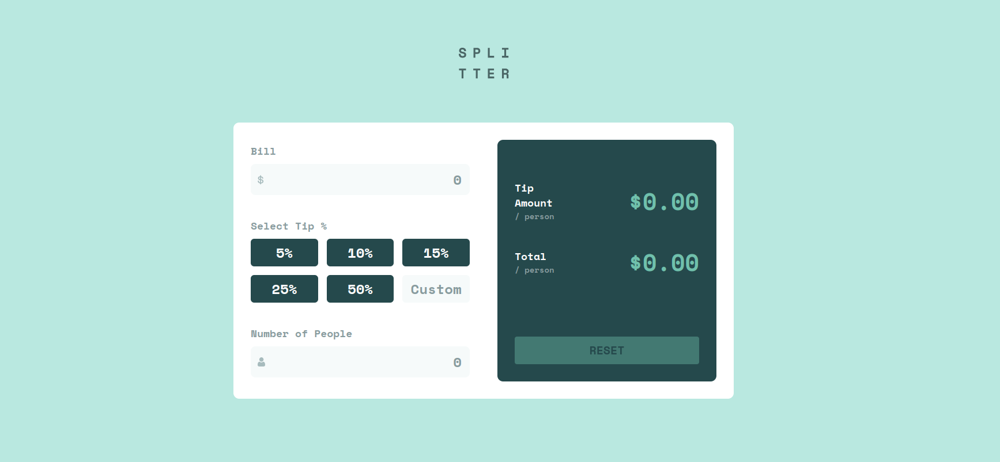

# Frontend Mentor - Tip calculator app solution

This is a solution to the [Tip calculator app challenge on Frontend Mentor](https://www.frontendmentor.io/challenges/tip-calculator-app-ugJNGbJUX). Frontend Mentor challenges help you improve your coding skills by building realistic projects.

## Table of contents

- [Overview](#overview)
  - [The challenge](#the-challenge)
  - [Screenshot](#screenshot)
  - [Links](#links)
- [My process](#my-process)
  - [Built with](#built-with)
  - [What I learned](#what-i-learned)
- [Author](#author)

## Overview

### The challenge

Users should be able to:

- View the optimal layout for the app depending on their device's screen size
- See hover states for all interactive elements on the page
- Calculate the correct tip and total cost of the bill per person

### Screenshot

### Links

- Solution URL: [https://dev-mitesh-lr.github.io/tip-calculator/]

## My process

### Built with

- Semantic HTML5 markup
- CSS custom properties
- Flexbox with reusable structures
- SCSS with variables
- Mobile-first workflow
- Custom JS
- jQuery

### What I learned

I had to design the project from scratch without Figma or any design provided, judging various properties and layout from an image, which added a new layer of challenge and skill refinement to the project.

## Author

- Frontend Mentor - [@dev-mitesh-lr](https://www.frontendmentor.io/profile/dev-mitesh-lr)
